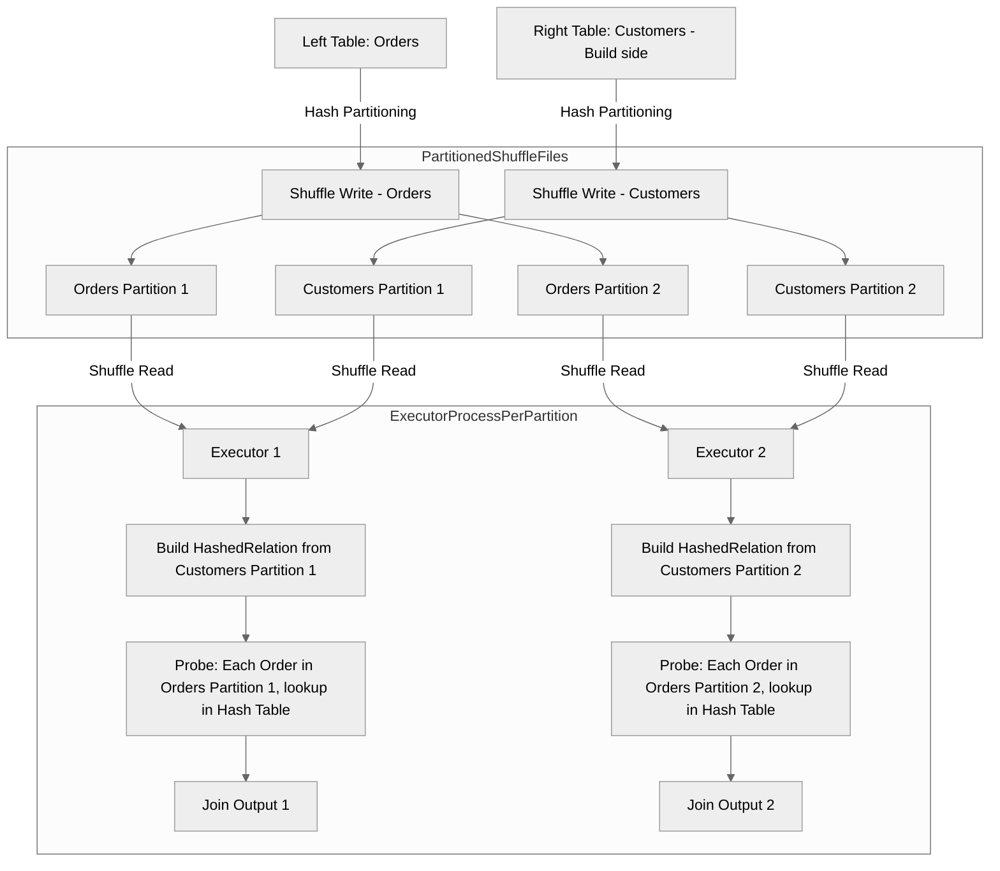

Shuffle Hash Join (SHJ) is a join strategy in Apache Spark that combines shuffling with hash-based joining.

It works by shuffling both datasets based on join keys to co-locate matching keys in the same partition, then building an in-memory hash table from the smaller dataset's partitions (also called the `build` side) and probing it with the larger dataset.

## Internal Architecture and Stages
Shuffle Hash Join execution involves **two main phases** with multiple underlying stages:
### Phase 1: Shuffle Phase
This phase redistributes data so that rows with the same join key end up on the same executor partition.

Here's the step-by-step process:
1. **Source Data Reading:** Both left and right datasets are read from their sources (HDFS, S3, etc).
2. **Partition Key Extraction:** For each row, Spark extracts the join key and computes a partition ID using **[[Hash Partitioner]]**
	- Uses **Murmur3Hash** function on the join key expressions
	- Applies the modulo operation
$$
\begin{gather*}
partitionId \ = \ hash(joinKey) \ \% \ numPartitions \\\\
numPartitions => spark.sql.shuffle.partitions
\end{gather*}
$$
3. **Shuffle Write (Map Side):**
	- Each partition of the source data is processed by a shuffle map task
	- Rows are serialized and written to the local disk as shuffle files
	- Shuffle metadata (locations, sizes) is registered with the **[[MapOutputTrackerMaster]]** on the driver
	- Creates intermediate shuffle files organized by (mapId, reduceId) pairs.
4. **Shuffle Read (Reduce Side):**
	- Executors fetch shuffle blocks from remote executors based on partition assignments
	- **[[MapOutputTracker]]** coordinates which blocks to fetch from which executors
	- Data is transferred over the network and deserialized into memory
	- After the shuffle, all rows with the same join key reside in the same partition
### Phase 2: Hash Join Phase
Perform a local hash join within each partition

Here's the step by step process:
1. **Build Side Selection:**
	- Spark selects the smaller side as the "build side" based on statistics
	- The larger side becomes the "probe side"
	- This decision is made ***per partition*** after the shuffle
2. **HashedRelation Construction:**
	- For each partition, the build side creates a **HashedRelation** (in-memory hash table):
		- `LongHashedRelation`: Used when the join key is a single `LongType` expression
		- `UnsafeHashedRelation`: Used for all other key types (composite keys, strings, etc.)
	- The hash table structure maps: `hash(joinKey) → List[InternalRow]`
	- This happens in the `buildHashedRelation` method of `ShuffledHashJoinExec`
3. **Probe and Match:**
	- The physical operator `ShuffledHashJoinExec` executes via `doExecute()` method
	  ```scala
	  doExecute() { 
		  streamedPlan.execute() // Get probe-side RDD 
		  buildPlan.execute() // Get build-side RDD 
		  // Zip partitions together 
		  streamedRDD.zipPartitions(buildRDD) { (streamIter, buildIter) => 
		  // Build hash table from build side 
		  val hashedRelation = HashedRelation(buildIter, buildKeys, ...) 
		  // Probe with stream side 
		  join(streamIter, hashedRelation, numOutputRows) 
		  } 
	  }
	  ```
	- For each row in the probe side:
		- Extract the join key using `streamSideKeyGenerator()`
		- Hash the key and look it up in the HashedRelation
		- If a match exists, create a `JoinedRow` combining both sides
		- Apply any additional join conditions (filter predicates)
		- Emit matched rows to the output
4. **Join Type Handling:**
	- **Inner Join:** Return rows only when matches exist in hash table
	- **Left Outer Join:** Return all probe-side rows, with nulls when no match
	- **Right Outer Join:** Return all build-side rows, with nulls when no match

>[!attention]
> Shuffle Hash Join is not selected for **Full Outer Joins**

## Visual representation of both the Phases



### Example for concrete understanding
- **Orders table:** 10 million rows, 5 GB
- **Customers table:** 100,000 rows, 50 MB
- **Join key:** `customer_id`
- **Configuration:** `spark.sql.shuffle.partitions = 200`

1. **Optimizer Decision**
	The optimizer chooses Shuffle Hash Join because:
	- Customers (50 MB) cannot be broadcast (threshold is 10 MB)
	- Orders (5 GB) / Customers (50 MB) = 100x ratio (much larger than 3x factor)
	- `preferSortMergeJoin` is disabled
2. **Shuffle Phase - Orders (Probe Side):**
	For each order row with `customer_id = 12345`:
	- Compute hash: `hash = Murmur3Hash(12345)`
	- Partition assignment: `partitionId = hash % 200` → suppose result is partition 47
	- Write to shuffle file: `shuffle_1_0_47.data` (shuffle_shuffleId_mapId_reduceId.data)
	This happens for all 10 million orders across all map tasks.

3. **Shuffle Phase - Customers (Build Side):**
	For each customer row with `customer_id = 12345`:
	- Compute hash: `hash = Murmur3Hash(12345)` (same hash function)
	- Partition assignment: `partitionId = hash % 200` → partition 47 (same as orders!)
	- Write to shuffle file: `shuffle_2_0_47.data`
	This happens for all 100,000 customers.

4. **Shuffle Read:**
	Executor E1 responsible for partition 47:
	- Fetches all shuffle blocks for partition 47 from orders (from multiple executors)
	- Fetches all shuffle blocks for partition 47 from customers (from multiple executors)
	- Now has all `customer_id = 12345` rows from both tables in local memory

5. **Hash Table Construction (Partition 47):**
	From the 500 customer rows in partition 47, build HashedRelation:
	```json
	{
	  12345 → [Row(12345, "Alice", "NY")],
	  12346 → [Row(12346, "Bob", "CA")],
	  12347 → [Row(12347, "Charlie", "TX")],
	  ...
	}
	```

6. **Probe and Join Phase (Partition 47):**
	For each order in partition 47 (50,000 orders):
	```text
	1. Order: (order_id=9001, customer_id=12345, amount=100.0)
	2. Extract join key: 12345
	3. Look up in hash table: hashedRelation.get(12345)
	4. Found: [Row(12345, "Alice", "NY")]
	5. Create JoinedRow: (9001, 12345, 100.0, 12345, "Alice", "NY")
	6. Emit to output
	```

7. **Parallel Execution:**
	All 200 partitions are processed in parallel across available executors. The final result is the union of all partition outputs.

	**Stage Breakdown:**
	When this is viewed in Spark UI, you'll see (assuming an action has been called):​
	- **Stage 0:** Read Orders and shuffle write → ShuffleMapStage
	- **Stage 1:** Read Customers and shuffle write → ShuffleMapStage
	- **Stage 2:** Shuffle read both sides + hash join + count → ResultStage
## Performance Metrics on Spark UI
This is how Hash Join metrics look in Spark UI

![[Shuffle-Hash-Join-Metrics-UI.png]]

All the metrics present here are self-explanatory:
- `data size of build side`: Size of data used to build the hash table
- `time to build hash map`: Time taken to construct the HashedRelation
- `num unique hash keys`: Total number of unique hash keys in the generated hash map
- `num of output rows`: Total number of rows produced by the join

## Spark Configurations impacting Shuffle Hash Join
- `spark.sql.join.preferSortMergeJoin (default=true)`: Must be `false` to prefer shuffle hash join
- `spark.sql.shuffledHashJoinFactor (default=3)`: Size ratio threshold for build side selection, i.e., shuffle hash join can be selected if the data size of small side multiplied by this factor is still smaller than the large side.
- `spark.sql.adaptive.maxShuffledHashJoinLocalMapThreshold (default=0b)`: Max partition size for AQE to convert SMJ to SHJ (0 = disabled)
- `spark.sql.shuffle.partitions`: Number of shuffle partitions used while defining `partitionId`.