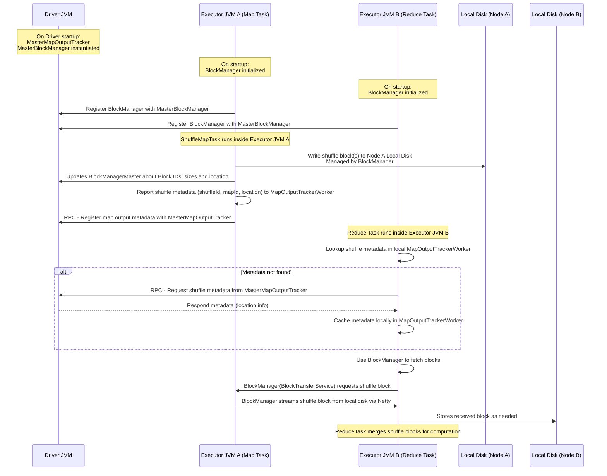
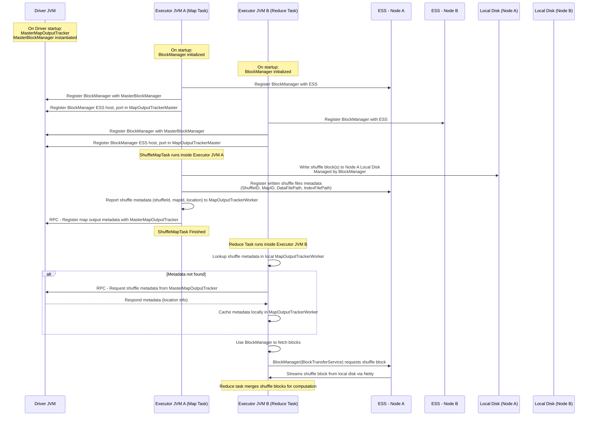
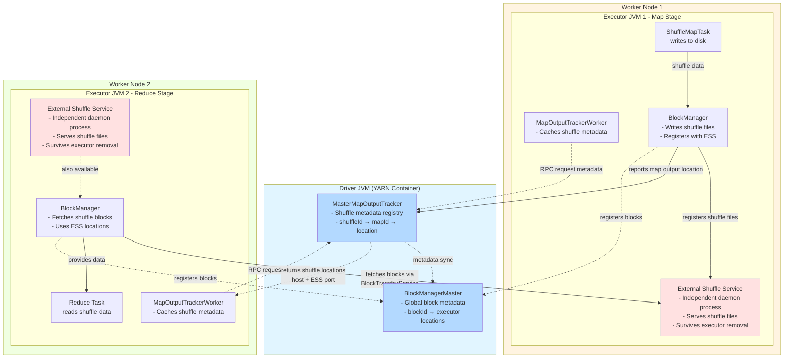

Every time anyone discusses the Spark Architecture, it only focuses on the MASTER and WORKER Nodes. This starts to get really boring, so let's look at some internal core components in Apache Spark.

The best part of knowing these is that next time you look into the logs, you will exactly understand what is happening when your Spark application is running, and it will be of great help in debugging the weird issues that you might face while running Spark Applications.

## Map Output Tracker
A core internal components that manage **shuffle map output metadata**, essentially keeping track of where the outputs from map tasks are located so that reduce tasks can fetch them efficiently.

These are **process-level components**, i.e., exist per JVM process, a.k.a. exists per executor.

Map Output Tracker also has a Master/Worker architecture:
- `MasterMapOutputTracker`: **Runs on the driver**
- `MapOutputTracker`: **Runs on executors**

### MasterMapOutputTracker
- **Runs on the driver** and holds the authoritative metadata about all shuffle map outputs for the ***whole*** application.
- After a shuffle map stage finishes, the driver collects:
    - Map task indexes → corresponding shuffle server locations.
    - Shuffle file identifiers. 
- This tracker serves metadata to executors when requested over RPC.
- It can invalidate, update, and broadcast new shuffle output mappings when reruns or speculative tasks happen.

### MapOutputTracker
- **Runs on executors** (worker nodes) to cache and use metadata about shuffle outputs.
- When a reduce task needs to read map outputs, it contacts the tracker to get information about:
    - The **executor location** (host/port).
    - **Block IDs** and sizes.
- The worker tracker pulls this metadata from the driver and caches it locally to avoid repeated requests.

### How do they work during Spark Application Execution?
1. **Map Stage Completion**
    - After map tasks finish writing shuffle data to disk (one file per reduce partition), each executor reports its shuffle output metadata back to the **MasterMapOutputTracker** on the driver.
2. **Metadata Storage**
    - `MasterMapOutputTracker` stores a mapping:
        `shuffleId --> mapId --> (host:port, blockId, size)`
    - This becomes the _global view_ of shuffle outputs.
3. **Reduce Stage Fetch**
    - When a reduce task is scheduled on a worker executor, Spark requests the shuffle output locations for the relevant `shuffleId` from the `MapOutputTrackerWorker`.
    - If the worker tracker doesn’t have this metadata in its local cache, it:
        - Sends an RPC to the driver’s `MasterMapOutputTracker`.
        - Gets the location metadata back.
        - Stores it locally for reuse (avoids multiple RPCs).
4. **Broadcast & Cache Invalidation**
    - If map outputs are ***LOST*** due to executor failure or re-computation, the driver invalidates certain map output locations in the `MasterMapOutputTracker`.
    - Updated metadata is then broadcast to workers.

## Block Manager
The `BlockManager` and `BlockManagerMaster` are **core components of Spark’s storage subsystem**, responsible for **tracking, storing, and serving physical data blocks** (e.g., RDD partitions, shuffle data, broadcast variables).

Block Managers are also **process-level components**, i.e., exist per JVM process, a.k.a. exists per executor.
- `BlockManagerMaster`: metadata registry on the driver.
- `BlockManager`: data store + communication layer per executor

### BlockManagerMaster
- Lives only inside the driver
- Maintains a **metadata registry** for all blocks across the cluster:
    `blockId --> [(executorId, storageLevel, size)]`
- Does **not** hold any data; it stores only metadata about which executor has which block.
- Syncs updates when executors register, store, remove, or lose blocks.
- Used for **scheduling locality-aware tasks** (e.g., trying to schedule tasks where their input partitions are cached).
### BlockManager
- **Lives inside each executor**
- Responsible for **storing** actual data blocks (RDD partitions, shuffle blocks, broadcast blocks) in memory, on disk, or off-heap.
- Handles:
    - Reads/writes to local storage.
    - Caching and eviction policies (LRU / size-based).
    - Serving data to other executors via Netty-based shuffle or BlockTransferService RPC.
    - Fetching remote blocks from peer executors when needed.

MapOutputTracker and BlockManager play a crucial role while fetching data from different nodes. Here's a simple example of how both these works together.
### How do MapOutputTracker and BlockManager work together?

1. **Initialization**
    - During driver initialization, `MasterMapOutputTracker` and `MasterBlockManager` are started
    - During executors initialization, 
	    - `MapOutputTracker` is started and registered with the driver.
	    - `BlockManager` is started and registered with the `MasterBlockManager`.
2. **Map Stage Output Registration**
    - Each `ShuffleMapTask` writes shuffle data to the local disk.
    - Executor A’s `BlockManager` manages these physical files (registered as shuffle blocks).
    - Executor A informs **driver’s `MasterMapOutputTracker`** about each output block’s location (host, port, sizes).
3. **Reduce Task Starts**
    - Executor B needs map outputs for its reduce partition.
    - It queries its local `MapOutputTrackerWorker`, which sends an RPC to the driver’s `MasterMapOutputTracker` if no cached info exists.
4. **Metadata Lookup (MapOutputTracker’s Role Ends Here)**
    - The driver responds with metadata:  
        _“For shuffleId=42, partition=3: executor on host A holds block X, host B holds block Y, etc.”_
    - Executor B caches this metadata.
5. **Block Fetch (BlockManager’s Role Begins Here)**
    - Using the received metadata, Executor B's `BlockManager` connects directly to the peer executors’ `BlockManagers` (e.g., on Executor A).
    - It requests the specific shuffle **block files** using the `BlockTransferService` (Netty).
6. **Data Transfer**
    - The producing executor’s `BlockManager` streams the requested shuffle block.
    - The consuming executor stores it temporarily in memory/disk via its `BlockManager`.
7. **Processing**
    - The reduce task merges all fetched shuffle blocks and computes the final results.

So both MapOutputTracker and BlockManager are at per-executor level, and store all the required details. What happens if the Executor goes down for whatever reason?!?

That's one of the reasons, when you see [[Reasons for FetchFailedException in Spark|FetchFailedException]], i.e., when the next stage task (Reducer Stage) tries to fetch the shuffle files from the executor that has gone down.

To avoid these scenarios, during any Spark Application running with [[Spark Dynamic Resource Allocation|Dynamic Resource Allocation]] enabled, the External Shuffle Service (ESS) is used.
## External Shuffle Service (ESS)
**External Shuffle Service (ESS)** is where Spark offloads shuffle data serving responsibilities **from executor BlockManagers** to an **independent daemon process** on worker nodes (ESS runs at the Node level and stays active until and unless the node is decommissioned).

Without ESS:
- Shuffle data (map outputs) live on **executors’ local disks**.
- If an executor JVM terminates (e.g., due to dynamic allocation), all its shuffle data becomes unreachable, since its `BlockManager` goes away.
- This forces massive **re-computation** of shuffle stages whenever executors are lost.

With ESS enabled:
- A **long-lived daemon process** (the External Shuffle Service) runs independently on each worker node (at port 7337 by default).
- It keeps shuffle files accessible even after the executors on that node exit.
- Executors delegate shuffle read/write registration to ESS instead of serving blocks themselves.

### What happens when ESS is enabled?
ESS is enabled via `spark.shuffle.service.enabled=true`

Updated Sequence Diagram with ESS Enabled

1. **Executor Starts**
    - The executor creates a `BlockManager` as usual.
    - It also opens a connection to the ESS running on the same node.
    - `BlockManager` registers its shuffle service endpoint (host, ESS port) in the `MapOutputTrackerMaster`.
2. **Map Task Writes Shuffle Files**
    - The executor still writes shuffle data to its local disk (e.g., `/localdir/blockmgr-*/shuffle_*`).
    - When `ShuffleMapTask` finishes, instead of relying solely on the executor’s BlockManager to serve those files later, it **registers the file metadata** with the ESS.
3. **ESS Registration**
    - The `BlockManager` on the executor **informs ESS** about:
        - Shuffle ID
        - Map ID
        - Data file paths
        - Index file paths
    - The ESS stores this mapping (shuffle → local disk file path).
4. **Executor Termination**
    - If the executor later exits (e.g., dynamic allocation scaling down), ESS **continues running** and can still serve those shuffle files.
    - Thus, downstream reduce tasks can fetch data from ESS instead of a dead executor.
5. **Reduce Task Fetch**
    - Reduce tasks get shuffle metadata (host + ESS port) via `MapOutputTracker`.
    - During fetch, their `BlockManager` contacts **the ESS instance on that host**, not the original executor.
    - ESS reads the local disk file and streams it back to the requesting executor using the same Netty `BlockTransferService` protocol.

Wait, what happens to the MasterBlockManager then?
- **Not all blocks are shuffle blocks!** Spark’s RDD persistence, broadcast, and many operations still rely on BlockManager-master coordination.
- The **ESS is only concerned with shuffle data**. The driver (via BlockManagerMaster) is still required to answer all other block status/location queries.

Below is a flowchart of the same process when ESS is enabled
